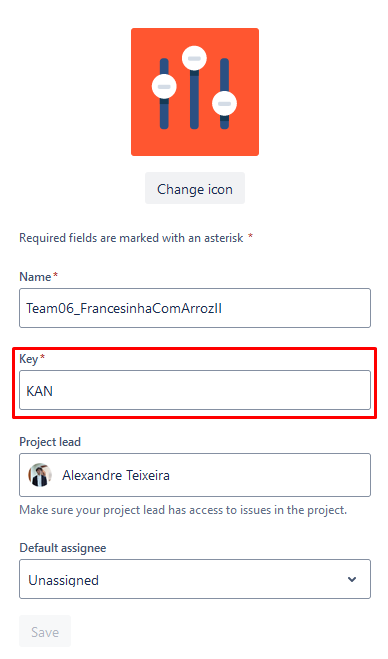
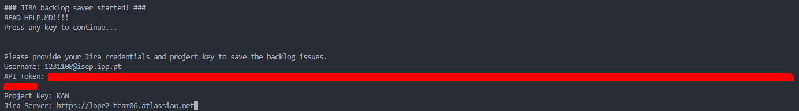
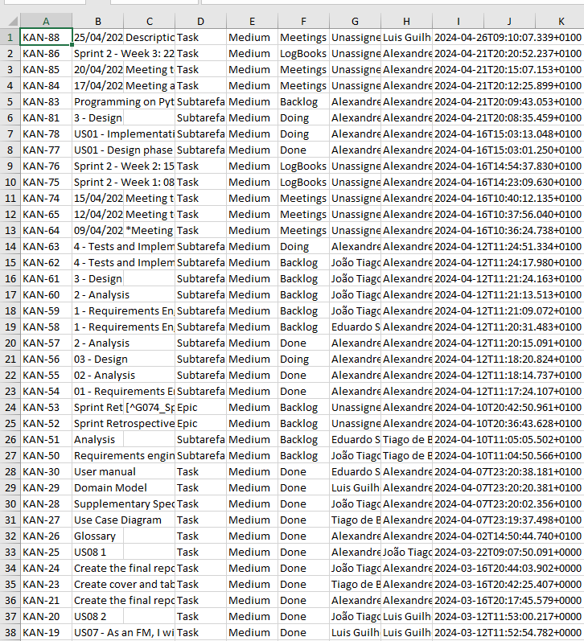

# JiraSaver

Jira saver is a python script to save your team's Jira backlog to an excel file.

## Requirements
To run this script you will need:
- Python's jira library [https://pypi.org/project/jira/](https://pypi.org/project/jira/)
Download and install using `pip install jira` or `easy_install jira`
If it peaks your interest, documentation can be found [here](https://jira.readthedocs.io/)
- Excel file writing library
Download and install using `pip install xlsxwriter`

## Necessary information
Upon running the script, you will be met with 4 questions.
These are necessary to properly identify and grant the script access your Jira project.
- Username: This is your Atlassian account username, it will most likely just be your ISEP email.
- API token: This is the access token to all your Jira projects. The code handles it safely, you can check for yourself :).
To obtain it follow the steps [here](https://support.atlassian.com/atlassian-account/docs/manage-api-tokens-for-your-atlassian-account/)
**COPY IT TO SOMEWHERE SAFE AND DON'T LOSE IT**
- Project key: You will find your project key by navigating to here:
<br>

<br>
- Server: the server is just your project's cloud URL trimmed, for example:
If this is your project's URL is something like: *https://lapr2-team06.atlassian.net/jira/software/projects/KAN/boards/1/backlog*
The server is that URL's server address: https://lapr2-team06.atlassian.net
<br>

In the end, you should see something like:


## Execution
The script can be ran from the command line as long as the python interpreter is properly installed and referenced in your computer's environment variables
```bash
python save_jira.py
```

## Outputs
Upon a successful finish, two files should be created:
- backlog_issues.json
- backlog_issues.xlsx

The excel file will have a neet table with all the information you need to recreate your board
<br>

<br>
While the JSON file will have it all structured in object notation so you can further treat the data any way you like


> Author: Tiago Simões, 1DG
